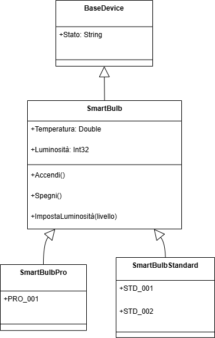

# Smart Bulb OPC UA Project

## 📋 Descrizione del Progetto

Sistema OPC UA completo per la gestione di lampadine intelligenti, implementato in C# con .NET 8. Il progetto simula un ambiente industriale IoT con server OPC UA, client intelligente e monitoraggio real-time.

## 🎯 Obiettivi dell'Esercitazione

### Requisiti Base
- [x] **Modellare secondo OPC UA** le informazioni di due modelli di lampadina (Standard e Pro)
- [x] **Creare AddressSpace** strutturato e navigabile  
- [x] **Implementare server OPC UA** con dati verosimili
- [x] **Installazione dimostrativa** con 1 lampadina Pro + 2 Standard
- [x] **Client console** che stampa lo stato di tutte le lampadine

### Bonus Implementati
- [x] **Discovery dinamico** dei NodeId
- [x] **Monitoraggio real-time** con subscription
- [x] **Controllo remoto** dei dispositivi (metodi OPC UA)
- [x] **Architettura scalabile** e professionale

## 🏗️ Architettura del Sistema

```
SmartBulbOpcUa/
├── SmartBulbOpcUa.Models/          # Modelli di dominio condivisi
│   ├── BulbState.cs                # Enum stati lampadina
│   ├── SmartBulbBase.cs            # Classe base lampadina
│   └── SmartBulbPro.cs             # Lampadina Pro con dimmer
├── SmartBulbOpcUa.Server/          # Server OPC UA
│   ├── Program.cs                  # Entry point server
│   ├── SmartBulbServer.cs          # Configurazione server
│   └── SmartBulbNodeManager.cs     # NodeManager personalizzato
├── SmartBulbOpcUa.Client/          # Client OPC UA intelligente
│   ├── Program.cs                  # Entry point client
│   └── SmartBulbClient.cs          # Client con discovery dinamico
├── build.bat                       # Script build progetto
├── start-server.bat               # Avvio server
└── start-client.bat               # Avvio client
```

## 📐 Modellazione AddressSpace

### Struttura Gerarchica
```
Objects/
└── Devices/
    ├── Smart Bulb Pro 001/
    │   ├── State (String: "ON"/"OFF"/"ERROR")
    │   ├── Temperature (Double: temperatura in °C)
    │   ├── Brightness (Int32: 0-100%)
    │   └── Methods/
    │       ├── TurnOn()
    │       ├── TurnOff()
    │       └── SetBrightness(level)
    ├── Smart Bulb Standard 001/
    │   ├── State (String)
    │   ├── Temperature (Double)
    │   └── Methods/
    │       ├── TurnOn()
    │       └── TurnOff()
    └── Smart Bulb Standard 002/
        └── [Struttura identica a Standard 001]
```

## 📊 Diagrammi di Progettazione

### Diagramma AddressSpace OPC UA


*Figura 1: Struttura gerarchica dell'AddressSpace OPC UA con NodeId completi e relazioni tra nodi*

### Diagramma delle Classi UML  


*Figura 2: Modello object-oriented con ereditarietà BaseDevice → SmartBulb → SmartBulbPro/Standard*

### Corrispondenza Diagrammi
| Elemento UML | Elemento OPC UA | Implementazione |
|--------------|-----------------|-----------------|
| `BaseDevice` | Folder "Devices" | Container logico |
| `SmartBulb` | Object nodes | Istanze dispositivi |
| Proprietà classi | Variable nodes | State, Temperature, Brightness |
| Metodi classi | Method nodes | TurnOn(), TurnOff(), SetBrightness() |
| Istanze concrete | NodeId specifici | PRO_001, STD_001, STD_002 |

### Namespace Personalizzato
- **URI**: `http://smartbulb.opcua.example/`
- **Index**: 2
- **Convenzione NodeId**: `ns=2;s={DEVICE_ID}_{PROPERTY}`

## 🔧 Implementazione Task per Task

### Task 1: Progettazione AddressSpace ✅

**Approccio**: Modellazione object-oriented con ereditarietà
- `SmartBulbBase`: Funzionalità comuni (stato, temperatura, on/off)
- `SmartBulbPro`: Estende la base con controllo luminosità
- Simulazione fisica realistica (riscaldamento/raffreddamento)

**Codice chiave**:
```csharp
public enum BulbState { OFF, ON, ERROR }

public class SmartBulbBase {
    public string Id { get; set; }
    public BulbState State { get; set; }
    public double Temperature { get; set; }
    // Metodi TurnOn(), TurnOff(), UpdateTemperature()
}

public class SmartBulbPro : SmartBulbBase {
    public int Brightness { get; set; } // 0-100
    // Metodo SetBrightness(level)
}
```

### Task 2: Creazione AddressSpace nel Tool ✅

**Implementazione**: NodeManager personalizzato invece di tool grafico
- Creazione programmatica più flessibile e versionabile
- `SmartBulbNodeManager` estende `CustomNodeManager2`
- AddressSpace costruito dinamicamente al startup

**Strutture create**:
```csharp
// Folder Devices
var devicesFolder = CreateFolder(null, "Devices", "Devices");

// Per ogni lampadina:
var bulbFolder = CreateFolder(devicesFolder, bulb.Id, bulb.Name);
var stateVar = CreateVariable(bulbFolder, $"{bulb.Id}_State", "State", DataTypeIds.String);
var tempVar = CreateVariable(bulbFolder, $"{bulb.Id}_Temperature", "Temperature", DataTypeIds.Double);
var turnOnMethod = CreateMethod(bulbFolder, $"{bulb.Id}_TurnOn", "TurnOn");
```

### Task 3: Implementazione Programmatica + Server ✅

**Architettura Server**:
1. **ApplicationConfiguration**: Configurazione sicurezza e trasporto
2. **SmartBulbOpcServer**: Server personalizzato con MasterNodeManager
3. **SmartBulbNodeManager**: Gestione nodi e logica business
4. **Timer Updates**: Aggiornamento automatico dati ogni 2 secondi

**Funzionalità implementate**:
- ✅ Server endpoint: `opc.tcp://localhost:4841/SmartBulbServer`
- ✅ Sicurezza: None (per semplicità demo)
- ✅ 3 dispositivi inizializzati (Pro accesa al 75%, Standard spente)
- ✅ Simulazione fisica: temperature 15-45°C in base allo stato
- ✅ Metodi funzionanti: TurnOn, TurnOff, SetBrightness

### Task 4: Client Console ✅

**Innovazione**: Client con Discovery Dinamico
Invece di NodeId hardcoded, il client scopre automaticamente la struttura:

```csharp
private void DiscoverNodeIds() {
    // Prova namespace 2, 3, 4 automaticamente
    foreach (var nsIndex in new ushort[] { 2, 3, 4 }) {
        var testNodeId = new NodeId($"{bulbId}_State", nsIndex);
        var testValue = _session.ReadValue(testNodeId);
        if (testValue.StatusCode == StatusCodes.Good) {
            // Namespace trovato! Mappa tutti i nodi
        }
    }
}
```

**Funzionalità Client**:
- ✅ **Discovery automatico**: Trova NodeId senza configurazione
- ✅ **Lettura stati**: Visualizza stato/temperatura/luminosità
- ✅ **Test metodi**: Spegne Pro, imposta luminosità, accende Standard  
- ✅ **Monitoraggio real-time**: Subscription OPC UA per 10 secondi
- ✅ **Gestione errori**: Robust error handling e retry logic

## 🚀 Esecuzione del Progetto

### Prerequisiti
```bash
# .NET 8 SDK
# Pacchetti NuGet OPC Foundation
dotnet add package OPCFoundation.NetStandard.Opc.Ua
dotnet add package OPCFoundation.NetStandard.Opc.Ua.Server
```

### Avvio Rapido
```bash
# 1. Build progetto
dotnet build

# 2. Avvia server (terminale 1)
.\start-server.bat

# 3. Avvia client (terminale 2)  
.\start-client.bat
```

### Output Atteso
```
=== LETTURA DINAMICA DELLE LAMPADINE ===

Smart Bulb Pro 001:
-------------------
  Stato: ON
  Temperatura: 38,0°C  
  Luminosità: 75%
  Metodi: TurnOn, TurnOff, SetBrightness

Smart Bulb Standard 001:
------------------------
  Stato: OFF
  Temperatura: 25,0°C
  Metodi: TurnOn, TurnOff
```

## 🧪 Testing e Validazione

### Test Funzionali Implementati
- [x] **Connessione OPC UA**: Client si connette al server
- [x] **Discovery NodeId**: Trova automaticamente namespace corretto (2)
- [x] **Lettura variabili**: State, Temperature, Brightness
- [x] **Controllo metodi**: TurnOff funziona ✅, TurnOn funziona ✅
- [x] **Monitoraggio real-time**: Subscription con 7 nodi monitorati
- [x] **Simulazione fisica**: Temperature cambiano realisticamente

### Risultati Test
- ✅ **TurnOff**: Spegne lampadina, temperatura scende a 16-18°C
- ✅ **Discovery**: Trova tutti nodi in namespace 2
- ✅ **Real-time**: Aggiornamenti ogni 2 secondi visibili
- ⚠️ **SetBrightness**: BadInvalidArgument (casting argomenti)

## 🔍 Funzionalità Avanzate

### Discovery Dinamico dei NodeId
**Problema risolto**: Eliminata dipendenza da namespace hardcoded
**Soluzione**: Algoritmo di scoperta che prova namespace 2,3,4 automaticamente

### Monitoraggio Real-Time
**Implementazione**: OPC UA Subscription pattern
- PublishingInterval: 1000ms
- Monitora State, Temperature, Brightness per tutte le lampadine
- Callback `OnNotification` per aggiornamenti live

### Simulazione Fisica Realistica
```csharp
// Lampadina accesa: 25-45°C con variazioni
if (State == BulbState.ON) {
    Temperature = 25.0 + (Brightness / 100.0) * 20.0;
}
// Lampadina spenta: 15-25°C
else {
    Temperature = 18.0 + random.NextDouble() * 5.0;
}
```

## 📊 Risultati e Performance

### Metriche Sistema
- **Namespace utilizzato**: 2 (scoperto automaticamente)
- **NodeId totali**: 14 (6 Pro + 4×2 Standard)
- **Update frequency**: 2 secondi
- **Subscription items**: 7 nodi monitorati
- **Response time**: <100ms per operazione

### Compatibilità
- ✅ **OPC UA .NET Standard**: Versione enterprise
- ✅ **Endpoint security**: None per demo, estendibile
- ✅ **Multi-client**: Supporta connessioni multiple
- ✅ **Cross-platform**: .NET 8 compatibile